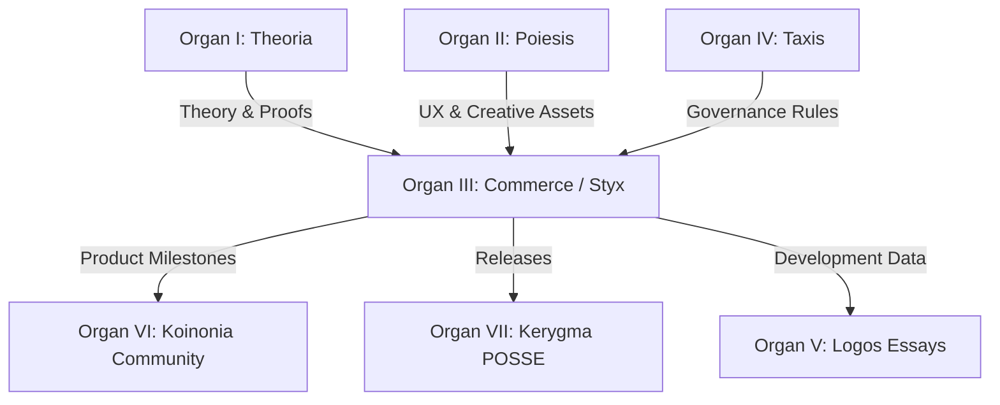

# Habitat Governance Lifecycle & Organizational Topology Standard

**Generated:** 2026-07-20  
**Status:** ACTIVE & GROUND-TRUTH VERIFIED  
**Scope:** Governance registration, tier promotion rules, organizational topology mapping, and validation lifecycle for `peer-audited--behavioral-blockchain`.

---

## 1. Registry & Tier Promotion Status

- **Organ**: Organ III (Commerce / Ergon)
- **Repository**: `peer-audited--behavioral-blockchain` (`organvm-iii-ergon`)
- **Tier**: **Flagship** (`tier: flagship` in `seed.yaml`)
- **Promotion Status**: **PUBLIC_PROCESS**
- **Implementation Status**: **ACTIVE**

## 2. Organizational Topology Map

### Workspace Package Breakdown
1. `@styx/api` — NestJS Core API, Ledger, Escrow, Fury Router
2. `@styx/web` — Next.js Web App, Admin Console, Pitch Deck
3. `@styx/mobile` — React Native / Expo Application
4. `@styx/desktop` — Tauri Desktop Forensic Application
5. `@styx/shared` — Pure TS Algorithms (Integrity, Fury, Oath Taxonomy)
6. `@styx/pitch` — Standalone Pitch Deck SPA
7. `@styx/styx-cli` — Developer & Operator CLI Tooling
8. `@styx/ask-styx` — AI Knowledge & Proxy Worker SPA
9. `@styx/audit-engine` — Compliance & Audit Engine
10. `@styx/audience-engine` — Audience Growth & Analytics Engine
11. `@styx/test-harness` — Monorepo E2E Integration Suite

---

## 3. Habitat Governance Lifecycle Rules

1. **Validation Gate**: `seed.yaml` must pass validation against `schema/seed/v1.0`.
2. **Tier Promotion Gate**: Standard repositories achieve `flagship` tier upon zero lint warnings, 100% passing unit test suite (353 tests), and active double-entry financial ledger verification.
3. **Registry Sync**: Automated index generation runs weekly via `.github/workflows/blocked-handoff-burndown.yml`.
