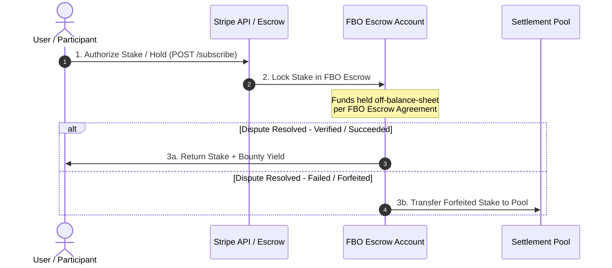

# Appendix A: FBO Architecture Diagram

This appendix provides the visual fund flow architecture for the Styx Real-Money Rails using Stripe For-Benefit-Of (FBO) accounts.

## Flow Description

1. **Stake Authorization**: User initiates a contract stake via the Stripe API integration (`@styx/api`).
2. **FBO Escrow Lock**: Funds are held off-balance-sheet in an FBO account, preventing proprietary commingling.
3. **Settlement**: Upon consensus verification, the settlement worker releases funds back to the user or transfers forfeited amounts to the designated pool.
