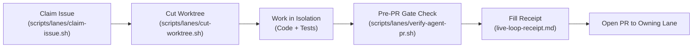

# Autonomous & External Agent Operations Manual

> **Scope**: Standard Operating Procedures for all AI agents, automated workers, and distributed engineers contributing to Styx (`4444J99/peer-audited--behavioral-blockchain`).

---

## 1. Core Principles & Doctrine

All agents operate under the four-stage doctrine: **Verify → Heal → Expand → Evolve**.

1. **Verify**: Can you prove what this repo claims? Run tests, check types, verify gates, ensure zero false claims.
2. **Heal**: Fix rot, restore broken routes, repair dependencies, close stale PRs. Do not build new features on top of broken foundations.
3. **Expand**: Complete the stated scope (App Store, real money, Stripe FBO, KYC, mobile bridges) without inventing an unrequested product.
4. **Evolve**: Improve architecture, DX, multi-tenancy, and performance only after the current form is true and verified.

---

## 2. Invariants You Must Never Violate

1. **Double-Entry Ledger Integrity (Gate 01)**:
   - Every credit must have an equal and opposite debit.
   - Zero phantom money. Never insert an account balance mutation without a corresponding balanced transaction pair in PostgreSQL.
2. **Linguistic Cloaker (Gate 04)**:
   - Production web, mobile, and desktop builds must never expose prohibited gambling terminology (`bet`, `stake`, `wager`, `payout`).
   - The runtime vocabulary swaps them to `commitment`, `vault`, `bounty`, `penalty`.
   - Run `bash scripts/validation/04-redacted-build-check.sh` locally to verify.
3. **Behavioral Physics Constants (Gate 05)**:
   - The loss-aversion coefficient ($\lambda = 2.0$) and related behavioral physics equations originate from `organvm-i-theoria/styx-behavioral-economics-theory`.
   - Styx strictly consumes Theory (I → II → III). Do not silently fork or modify these constants in code.
   - Run `npx tsx scripts/validation/05-behavioral-physics-check.ts`.
4. **Zero Secret Leaks**:
   - Never commit `STRIPE_SECRET_KEY`, `JWT_SECRET`, database passwords, private certificates, or live user KYC data into git.

---

## 3. Step-by-Step Issue Execution Lifecycle



### Step 1: Claim the Issue
Before writing code, claim the target issue in `docs/triage.json`:
```bash
scripts/lanes/claim-issue.sh <issue-number> [agent-id]
```
This transitions the issue state to `BUILD_STARTED` and records the agent identity to prevent duplicate effort by concurrent agents.

### Step 2: Cut an Isolated Worktree
Consult the Issue Ownership Directory (`docs/triage/issue-ownership.json`) or let the automation handle it:
```bash
scripts/lanes/cut-worktree.sh <issue-number> [short-intent]
```
- The script automatically determines the owning lane (`lane/verify`, `lane/heal`, `lane/expand-product`, `lane/expand-external`, or `lane/evolve-platform`).
- It creates a dedicated git worktree in `.worktrees/work-<lane>-<issue>-<intent>` branched from the owning lane.

### Step 3: Implement & Test Inside the Worktree
Navigate to your isolated worktree:
```bash
cd .worktrees/work-<lane>-<issue>-<intent>
```
Run workspace-specific tests during development:
```bash
cd src/api && npx jest
cd src/web && npx jest
cd src/mobile && npx jest
cd src/desktop && npx jest
```

### Step 4: Pre-PR Verification
Before committing or opening a PR, run the universal agent gatekeeper from the repo root or inside the worktree:
```bash
bash scripts/lanes/verify-agent-pr.sh
```
This executes:
- Branch naming convention check
- Staged secrets and `.env` sweep
- Gate 04 (Linguistic Cloaker sweep)
- Gate 05 (Behavioral Physics constants check)
- Gate 01 (Phantom Money / Ledger balance integrity)
- TypeScript strict compile (`npx turbo run lint`)

### Step 5: Live Loop Receipt & PR Submission
Generate your PR description using the **Live Loop Receipt Template**:
`docs/evidence/templates/live-loop-receipt.md`.

Set the PR **base branch** to the owning standing lane:
- Bugfixes & repairs → Base: `lane/heal`
- Mobile/Client features & beta rollout → Base: `lane/expand-product`
- Legal, escrow & external credentials → Base: `lane/expand-external`
- Dogfood & pilot validation → Base: `lane/verify`
- B2B & platform evolution → Base: `lane/evolve-platform`
- Emergency trunk fixes → Base: `main`

---

## 4. Multi-Agent Conflict Prevention

1. **Never edit `docs/triage.json` without atomic reconciliation**:
   - Use `scripts/triage/state-transition.sh` and `scripts/triage/reconcile.sh`.
2. **Never force-push to standing branches**:
   - `main` and all `lane/*` branches are append-only.
3. **Synchronize standing lanes regularly**:
   - Before cutting a new branch or merging a PR, run `scripts/lanes/sync-lanes.sh` to ensure your standing lane is aligned with `main`.
