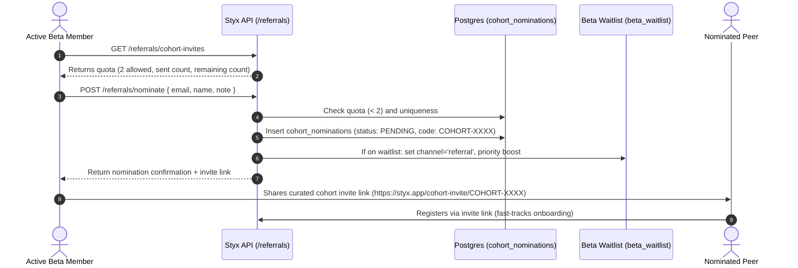

# Beta Cohort Referral & Peer Nomination Mechanic

**Status:** ACTIVE  
**Owner:** Growth, Marketing & Product  
**Related Issues:** #345, #288  
**API Endpoints:** `GET /referrals/cohort-invites`, `POST /referrals/nominate`

---

## 1. Objective & Philosophy

The objective of the Beta Cohort Referral Loop is to drive **high-conviction, qualified beta growth** without transforming the Styx beta into an unmoderated, open-door public launch. 

Behavioral accountability contracts require high peer trust and personal commitment. Mass unvetted referrals dilute accountability norms and skew loss-aversion mechanics. Therefore, the referral mechanic enforces strict scarcity:
- **Maximum 2 peer nominations** per active beta member (`BETA_MAX_COHORT_INVITES = 2`).
- Nominations must be intentional endorsements with an optional relationship note.
- Nominated peers receive prioritized admission from the waitlist into active cohorts.

---

## 2. Architecture & Data Flow



---

## 3. Endpoints & Data Contracts

### 3.1 `GET /referrals/cohort-invites`
Returns the user's invite quota and current nominations list.

**Headers:**
- `Authorization: Bearer <jwt_token>`

**Response (200 OK):**
```json
{
  "totalAllowed": 2,
  "invitesSent": 1,
  "remainingInvites": 1,
  "nominations": [
    {
      "id": "7f09802a-2895-4673-8260-35ecb3a2be85",
      "nomineeEmail": "colleague@domain.com",
      "nomineeName": "Alex Rivera",
      "inviteCode": "COHORT-9A4B8F12",
      "inviteUrl": "https://styx.app/cohort-invite/COHORT-9A4B8F12",
      "status": "PENDING",
      "createdAt": "2026-09-12T10:00:00.000Z"
    }
  ]
}
```

### 3.2 `POST /referrals/nominate`
Nominates an aligned peer. Enforces quota limits and deduplication.

**Request Body:**
```json
{
  "nomineeEmail": "peer@example.com",
  "nomineeName": "Jordan Smith",
  "note": "Accountability partner for 60-day deep work sprint."
}
```

**Response (201 Created):**
```json
{
  "id": "18f97b42-70b9-4081-9b19-e5879a834164",
  "nominatorId": "user-uuid",
  "nomineeEmail": "peer@example.com",
  "nomineeName": "Jordan Smith",
  "note": "Accountability partner for 60-day deep work sprint.",
  "inviteCode": "COHORT-F1234ABC",
  "status": "PENDING",
  "acceptedUserId": null,
  "createdAt": "2026-09-12T10:15:00.000Z",
  "acceptedAt": null
}
```

---

## 4. Verification & Operational Checks

To verify referral and nomination functionality:
```bash
# Run unit tests
cd src/api && npx jest referral.controller.spec.ts referral.service.spec.ts
```

For schema validation, table `cohort_nominations` is defined in migration `073_cohort_nominations.sql` and enforced with foreign keys to `users(id)` and unique constraints on `(nominator_id, nominee_email)`.
